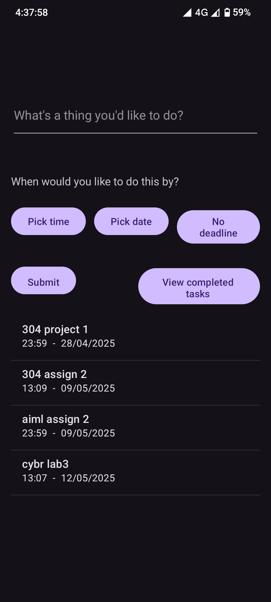
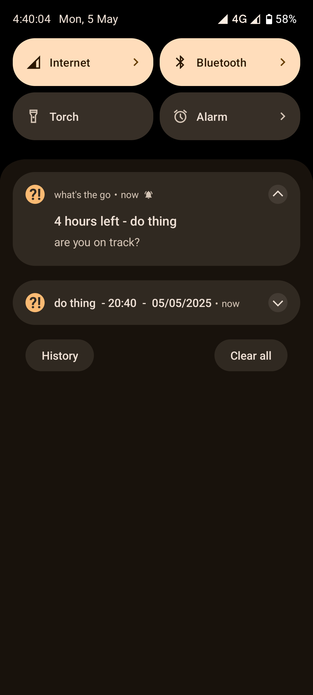

# whats-the-go

An android app to manage tasks. Creates a notification you can leave to remind you, and the app will send you reminder notifications if you've set a deadline. 

I made this because I didn't like the other reminder apps I'd tried, and I wanted to learn to use android studio.

  
  

